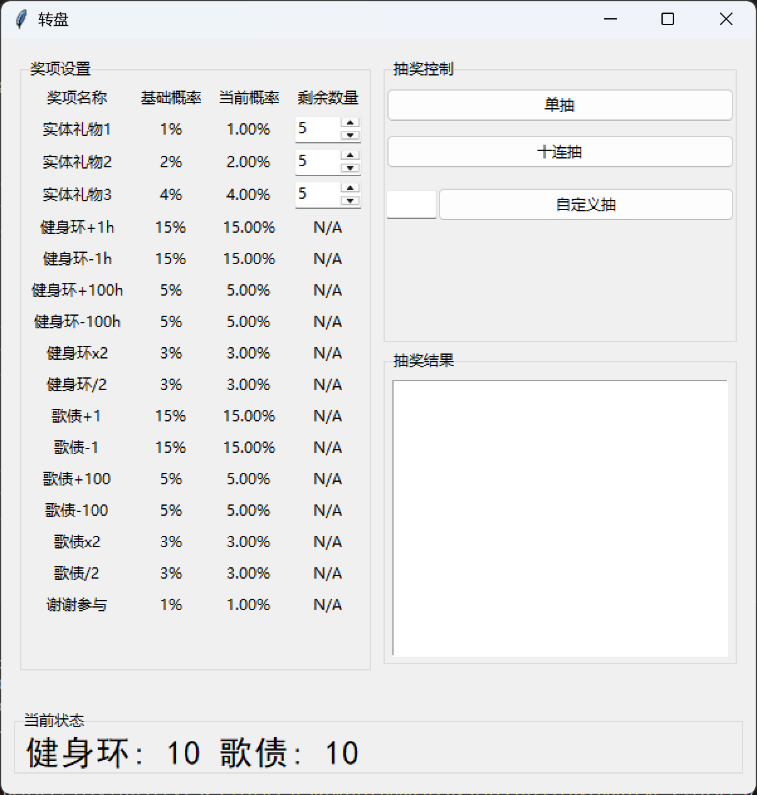

# CustomLottery

“一款可高度自定义、带图形界面的抽奖程序”

## 项目简介
[视频介绍](https://www.bilibili.com/video/BV1XMJPzwEUw/)

CustomLottery 是一个基于 Python 和 Tkinter 的抽奖小工具，支持：

- 自定义奖品列表及每个奖品的具体信息
- 限量奖品实时扣减，动态调整中奖概率
- 对奖品数值（如“健身环时长”）的动态增减、乘除操作
- 自动保存当前状态（包括奖品库存和数值奖品的累计值）
- 在日志文件记录历史抽奖结果，方便查询
- 直观的图形界面，操作简单
- 可调节透明度，方便自定义背景

## 功能特性

- **灵活配置**：在 `config.json` 中定义 `records`、`awards`、`opacity` 等参数（详见[配置说明](#配置说明configjson)）
- **限量奖品**：自定义限量奖品，抽中时自动扣减库存，库存为 0 时不再抽中，中奖概率按原比例分配给其他奖项
- **数值奖品**：支持对数值奖品（如健身环时长）的“加／减／乘／除”效果  
- **实时记录**：历史抽奖结果实时记录到日志，默认保存在 `lottery.log`  
- **用户界面**：支持单次抽奖、连抽、自定义抽奖次数，结果在主窗口显示（见下图）

## 安装与依赖
在以下三种方法中任选其一，其中方法1和方法2需要安装Python>=3.9，方法3不需要安装Python。
1. 克隆本仓库  
```bash
git clone https://github.com/ZhenxuanSu-Sine/CustomLottery.git
cd CustomLottery
python main.py
```
2. 下载 ZIP 包  
    解压后在终端中进入该目录
```bash
cd /path/to/CustomLottery
python main.py
```

3. 在 [Release 页面](https://github.com/ZhenxuanSu-Sine/CustomLottery/releases/latest) 中下载 exe 可执行文件 
   
    需要另外下载 `config.json` 文件，和exe文件放在同一目录下，然后直接运行 `CustomLottery.exe` 即可。该方法不需要安装Python。

## 配置说明（`config.json`）
> [!Warning]
> 程序在运行中需要读取和写入 `config.json` 文件，因此请确保该文件和程序（exe或py）在同一目录下，并且程序有权限读写它们。
> 
> 在运行程序前，最好关闭编辑 `config.json` 的应用（如记事本），以免文件被占用。
> 
> 已知：在Windows系统上，使用CustomLottery.exe时，如果config.json文件被记事本占用，可能会导致程序报错。
```json
{
  "opacity": 0.8,               // 窗口透明度，取值 0.0–1.0
  "records": {                  // 每种“数值型”奖品的初始累计记录
    "健身环": 10,                // 奖品的名称和累计值，可在`config.json`直接修改以设定初始值
    "歌债": 10
  },
  "awards": [
    {
      "name": "实体礼物1",    // 奖品名称
      "award_type": "限量",   // 奖品类别，只能为以下几种之一：“限量”、“其他”、records 中定义的奖品名称（本例子中，为“健身环”和“歌债”）
      "base_prob": 1,        // 基础概率（百分数，可以为小数），所有奖品的基础概率之和必须为100
      "remaining": 5         // 剩余数量，只有“限量”奖品有此属性
    },
    {
      "name": "健身环+1h",
      "award_type": "健身环", // 奖品类别为“健身环”，表示该奖品的操作会影响“健身环”记录
      "base_prob": 15,
      "operation": {         // 只有“数值型”奖品有此属性，表示该奖品对累计值的操作
        "type": "add",       // 支持 add, sub, mul, div，对应加、减、乘、除（向下取整），
        "value": 1
      }
    },
    {
      "name": "歌债-1h",
      "award_type": "歌债",   // 奖品类别为“歌债”，表示该奖品的操作会影响“歌债”记录
      "base_prob": 10,
      "operation": {
        "type": "sub",       
        "value": 1
      }
    },
    {
      "name": "谢谢参与",
      "award_type": "其他",
      "base_prob": 1
    }
    // … 其他奖品
  ]
}
```

## 日志与数据
- 日志文件：lottery.log，记录每次抽奖的时间、奖品名称、更新前后记录。
- 配置文件：config.json，可修改奖品及各种设置，无需改动源码。

## Windows 可执行文件

本仓库的 [Releases 页面](https://github.com/ZhenxuanSu-Sine/CustomLottery/releases/latest) 中包含了使用 PyInstaller 打包的 Windows 单文件可执行程序，生成命令如下：

```bash
pyinstaller --onefile --windowed --upx-dir /path/to/upx main.py
```

## 授权协议
该项目采用 [Unlicense（零条款公共领域声明）](https://unlicense.org/)，任何人可自由使用、修改、分发。详见[LICENSE 文件](LICENSE)。
